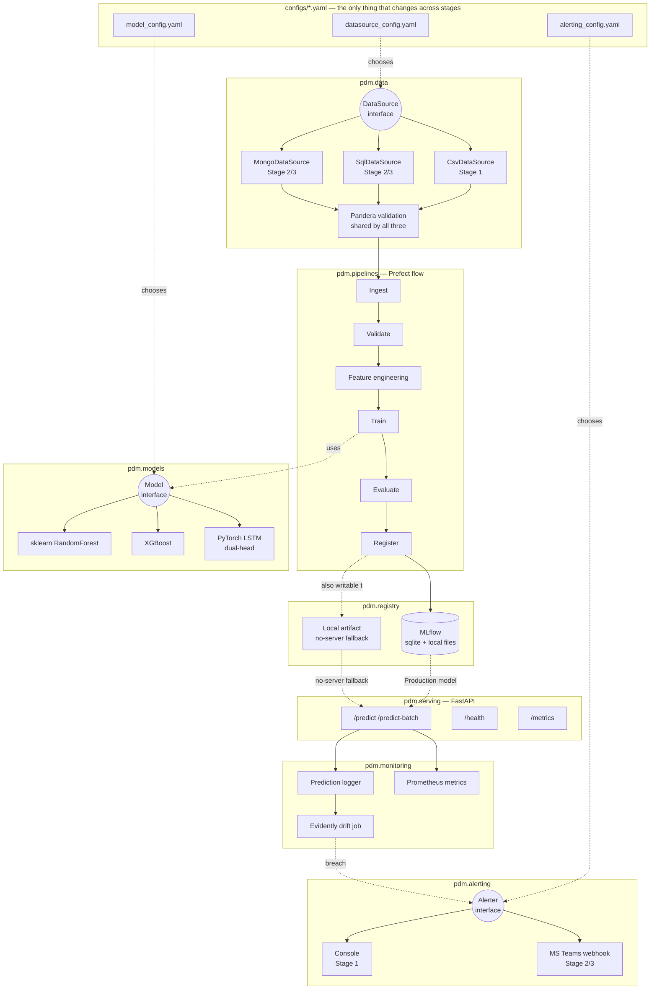

# Industrial Predictive Maintenance — MLOps Platform

[](https://github.com/Sudhar1610/Hello-world/actions/workflows/ci.yml)
[](https://github.com/Sudhar1610/Hello-world/actions/workflows/model_validation.yml)
[](LICENSE)
[](pyproject.toml)

An end-to-end predictive maintenance system for industrial turbofan
assets: two model heads (binary failure classification + remaining
useful life regression) trained on multivariate sensor time-series,
served behind a FastAPI inference API, tracked in a local MLflow
registry, monitored for data drift, and orchestrated by a reproducible
Prefect pipeline.

The defining constraint: this same codebase is meant to run in three
very different environments — a laptop, an air-gapped office network,
and a fully offline industrial server — and moving between them must be
a **config change, never a code change**. See [`docs/STAGES.md`](docs/STAGES.md).

## Problem

Reference dataset: NASA's C-MAPSS Turbofan Engine Degradation Simulation
(FD001 subset) — 100 training engines and 100 test engines, each a
multivariate time series of 21 sensors + 3 operational settings, run to
failure. Two prediction targets per cycle:

1. **Classification** — will this engine fail within the next *N* cycles?
2. **Regression** — how many cycles of remaining useful life (RUL) does
   it have?

This is the standard industrial-credible stand-in for real machine
telemetry: the architecture is built so swapping FD001 for a real
plant's SQL/MongoDB feed requires editing YAML, not application code.

## Architecture



**Clean architecture, strictly enforced**: `pdm.features`, `pdm.models`,
and `pdm.pipelines` never import a concrete `CsvDataSource`,
`SqlDataSource`, `ConsoleAlerter`, or `TeamsAlerter` — only the
`DataSource`/`Alerter`/`Model` interfaces, built by a factory that reads
the active choice out of YAML. That's the whole mechanism behind
config-only stage promotion.

## Quickstart (Stage 1 — local dev)

```bash
# 1. One-time setup (conda; see environment.yml). A plain venv + pip
#    works too for local dev -- see pyproject.toml.
make setup

# 2. One-time online step: download the C-MAPSS FD001 dataset.
make data

# 3. Run the full pipeline: ingest -> validate -> feature -> train ->
#    evaluate -> register (as Staging in the local MLflow registry).
make train

# 4. Promote to Production if it doesn't regress vs the current one
#    (first run promotes unconditionally).
python scripts/validate_and_promote_model.py

# 5. Serve it.
make serve
# -> POST http://localhost:8000/predict
# -> GET  http://localhost:8000/health
# -> GET  http://localhost:8000/metrics

# Or bring up the full local stack (MLflow UI, Prefect server, API,
# Prometheus, Grafana):
make up
```

Run the test suite: `make test` (pytest, >90% coverage on core logic).
Lint/format/typecheck: `make lint`.

## Results (FD001, unit-level 80/20 split, XGBoost baseline)

Trained on 80 engines, evaluated on 20 held-out engines (no engine
appears in both splits — this measures generalization to unseen assets,
not just unseen cycles of a known one).

| Head | Metric | Value |
|---|---|---|
| Classification (fails within 30 cycles) | Accuracy | 0.976 |
| | Precision | 0.943 |
| | Recall | 0.906 |
| | F1 | 0.924 |
| | ROC-AUC | 0.996 |
| Regression (RUL, cycles) | RMSE | 16.7 |
| | MAE | 11.6 |
| | R² | 0.852 |
| | NASA score* | 37,093 |

\* The asymmetric NASA C-MAPSS scoring function (Saxena et al., 2008),
summed over the test set — penalizes a late (optimistic) RUL prediction
far more steeply than an early one, matching the real cost asymmetry of
missing a failure vs. an unnecessary maintenance call. Lower is better;
it is not a per-sample average, so only compare it against other runs on
the same test set size.

Reproduce with `make train` after `make data` (seeded: `training.seed`
in `configs/model_config.yaml`).

## Project layout

```
configs/        pydantic-validated YAML: datasource, alerting, model, logging
src/pdm/
  data/          DataSource interface + CSV/SQL/MongoDB implementations
  features/      rolling stats, lags, degradation slopes, labels, sequences
  models/        Model interface + sklearn/XGBoost/LSTM backends
  registry/      local MLflow registry + no-server local artifact fallback
  evaluation/    metrics (incl. NASA score), threshold tuning, drift
  serving/       FastAPI inference API
  alerting/      Alerter interface + console/Teams implementations
  monitoring/    prediction logging, drift job, Prometheus metrics
  pipelines/     Prefect training flow
tests/           unit + integration (pytest)
docker/          multi-stage Dockerfiles + docker-compose (local stack)
scripts/         download_data.py (the only online step), build_bundle.sh,
                 validate_and_promote_model.py (CI gate)
docs/            architecture, stage-promotion guide, AWS migration map, ADRs
```

## Further reading

- [`docs/STAGES.md`](docs/STAGES.md) — exact steps to promote Stage 1 → 2 → 3
- [`docs/AWS_MIGRATION.md`](docs/AWS_MIGRATION.md) — mapping every local
  component to its AWS-managed equivalent
- [`docs/architecture.md`](docs/architecture.md) — deeper architecture notes
- [`docs/runbook.md`](docs/runbook.md) — operating the system day-to-day
- [`docs/adr/`](docs/adr/) — architecture decision records
- [`PROJECT_NOTES.md`](PROJECT_NOTES.md) — current deployment stage
- [`LICENSE`](LICENSE) — MIT
